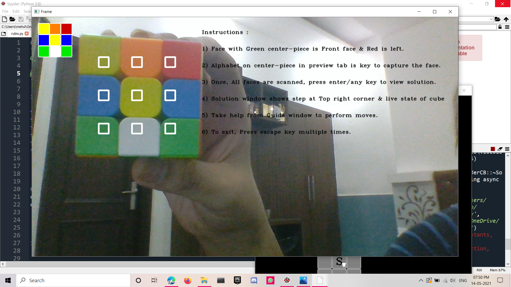
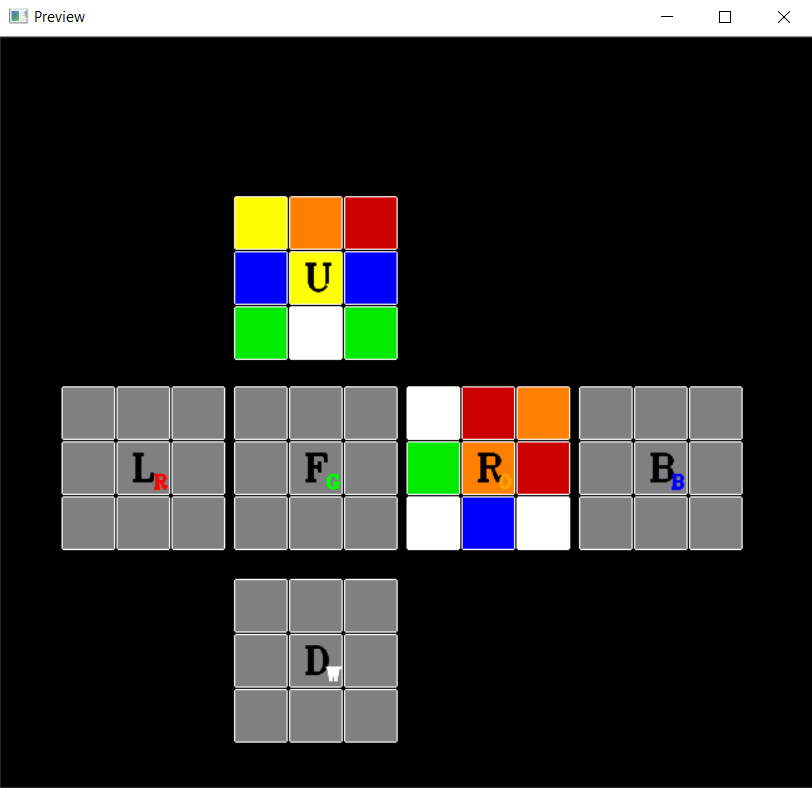
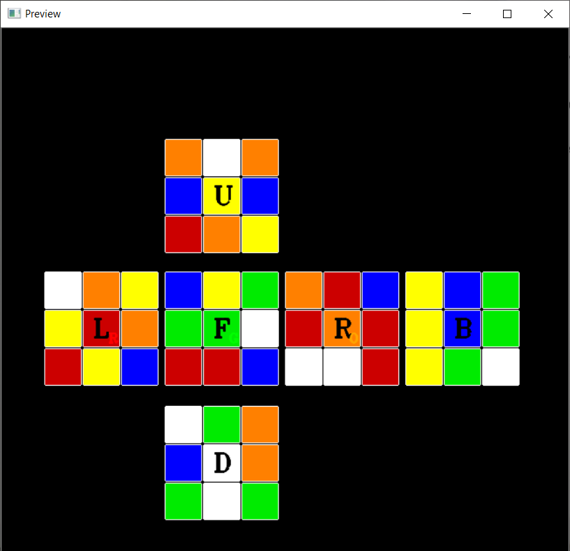
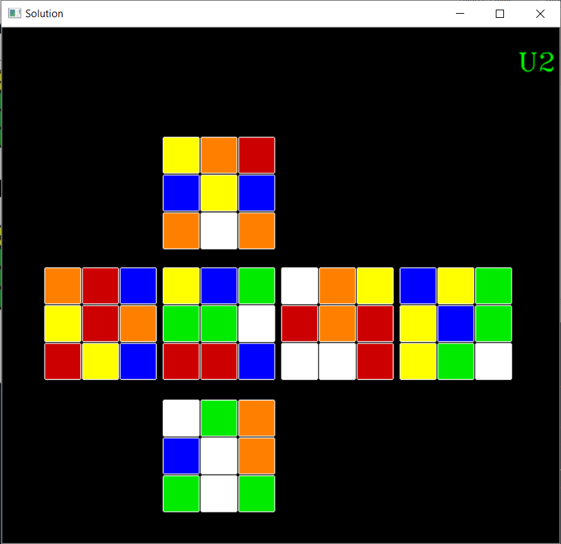

# Curb The Cube 
 
 
 
Speedcubers, After years of practice and around a hundred algorithms take around 50-60 moves while solving the classic 3x3 Rubix cube. What if I tell you that you can do the same in without any effort and in only 20 moves. This Project allows even layman to nail the cube in minimal moves.

“The Cube is an imitation of life itself - or even an improvement on life.”
-- Erno Rubik

How to Curb the Cube ?

Read The Instructions on the Frame window

 

Preview_Window after scanning Up and Right Face

 

Once all the faces are scanned, Press enter to view the Solution Window

 

Solution window contains the Move at the Top right Corner and The live state of the cube.

***Note :  
Face Notation :  
Green - Front  
Orange - Right  
Red - Left  
White - Down  
Yellow - Up  
Blue - Back***  

This is how you are supposed to hold the cube in your hand while scanning and solving the cube

***Pressing the Key on the Center-piece of Faces of the Preview window will Store the face's Colors.***
eg. F key will capture Front Face.
